<div align="center">

# 🎬 CineNow

**A cinematic movie-reservation app for Android**
Browse films · pick seats on a live map · keep your tickets in one place


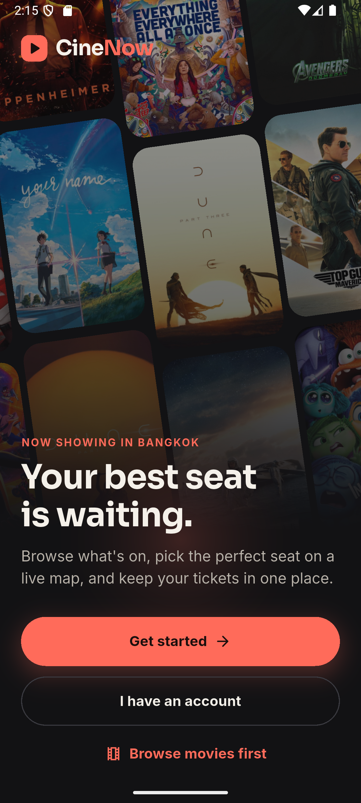&nbsp;
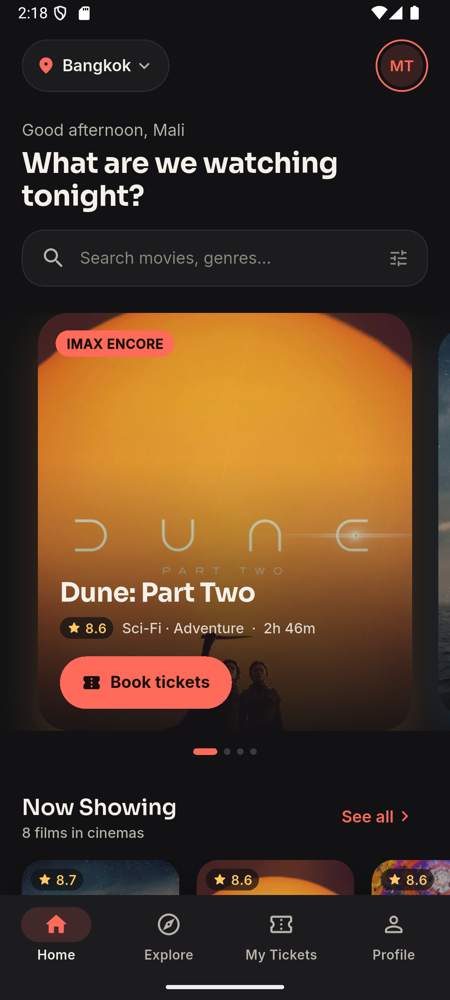&nbsp;
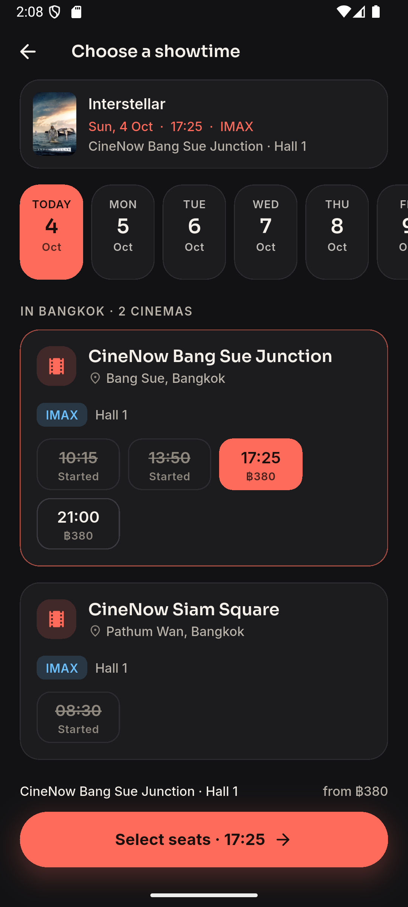&nbsp;
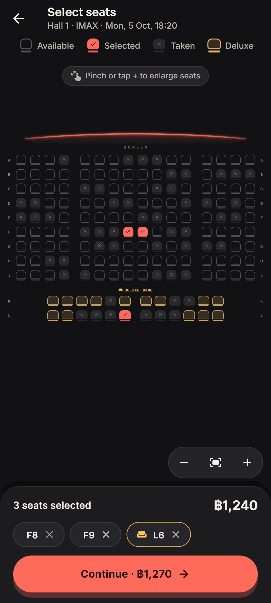

</div>

---

## 📲 Try it in 1 minute (no coding needed)

1. On your Android phone, open the **[Releases page](https://github.com/Tammarong/cinenow/releases/latest)**.
2. Download **`CineNow.apk`**.
3. Open the file and tap **Install**. If Android asks, allow installing from your browser or Files app.
4. Open **CineNow**, tap **Browse movies first** to look around, or **Get started** to create an account with your email.

> 💡 Booking is a **demo**: no payment is taken, and the QR code on your ticket is decorative.

---

## 🚀 Run from source

**You need:** [Flutter 3.44+](https://docs.flutter.dev/get-started/install) and an Android phone (USB debugging on) or an Android emulator.

```bash
git clone https://github.com/Tammarong/cinenow.git
cd cinenow
flutter pub get
flutter run
```

That's it. The app is **already connected** to a working Firebase project, with sign-in, movies, showtimes and seats ready to go. No Firebase setup is needed.

### Other ways to run

| I want to… | Command |
| --- | --- |
| Use the live app (default) | `flutter run` |
| Try it **without any Firebase** (sample data, saved only on the device) | `flutter run --dart-define=FORCE_DEMO=true` |
| Use local Firebase emulators | `flutter run --dart-define=USE_EMULATORS=true` (see **Testing** below) |
| Build an APK to share | `flutter build apk --release` → `build/app/outputs/flutter-apk/app-release.apk` |

> In **Demo mode** an amber banner says so. Accounts and tickets stay on the phone and are never sent to Firebase.

---

## ✨ What you can do

| | |
| --- | --- |
| 🏠 **Home** | Featured carousel, *Now Showing* and *Coming Soon*, city picker |
| 🔍 **Explore** | Search by title or cast, filter by genre or status |
| 🎞️ **Movie details** | Backdrop, rating, runtime, age rating, synopsis, cast |
| 🕒 **Showtimes** | 7-day date strip, cinemas grouped by city, IMAX / 4DX / Dolby Atmos |
| 💺 **Seat map** | Curved screen, Deluxe rows, pinch-to-zoom, live availability |
| 🧾 **Review** | Clear price breakdown; sign in only when you're ready to confirm |
| 🎟️ **Tickets** | Animated confirmation, digital ticket, upcoming / past list |
| 👤 **Profile** | Edit name, preferred city, sign out |

**Booking is safe:** seats are only reserved when you press **Confirm**, using a single all-or-nothing write. If someone else grabs your seat first, the app tells you which one and keeps the rest of your selection.

<details>
<summary><b>More screenshots</b></summary>
<br>
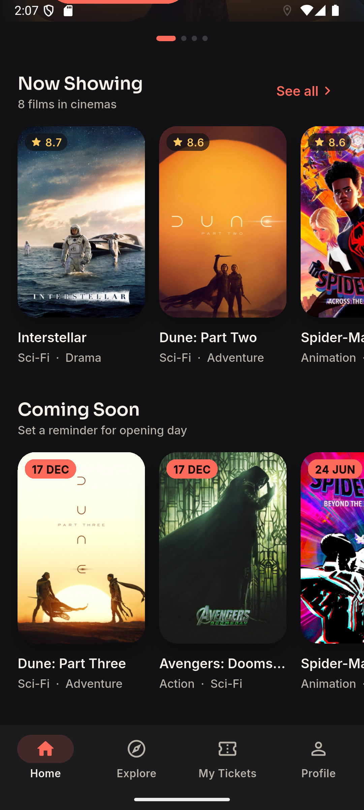&nbsp;
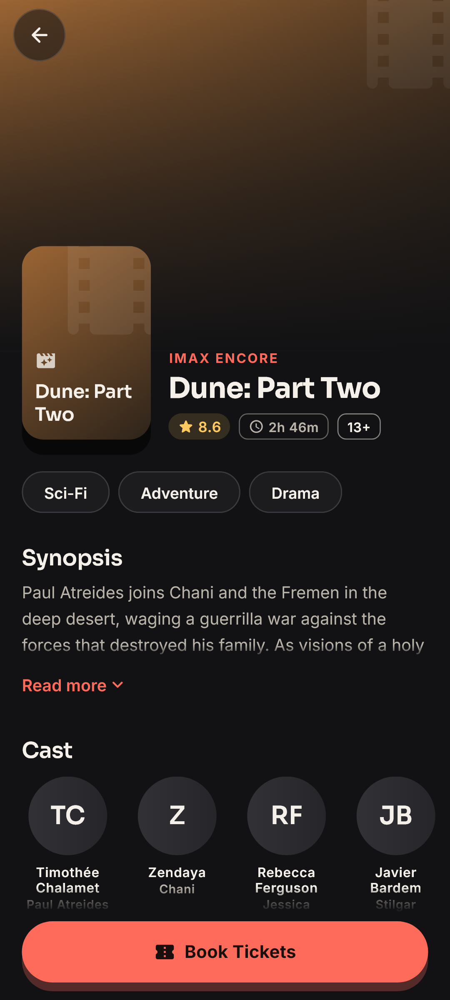&nbsp;
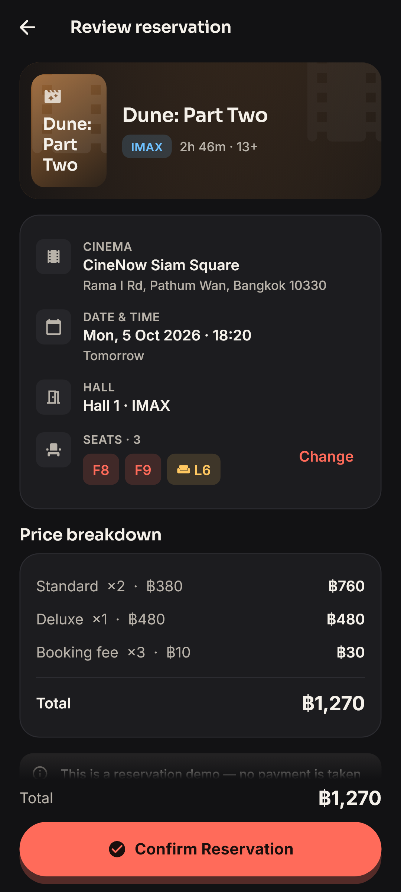&nbsp;
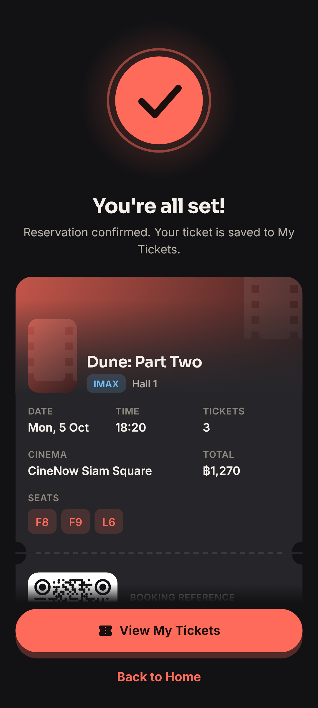
<br><br>
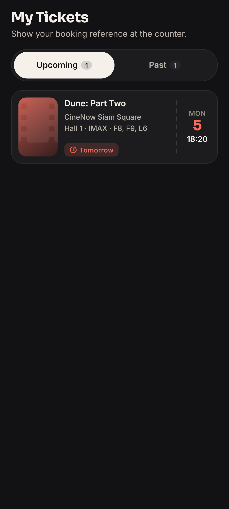&nbsp;
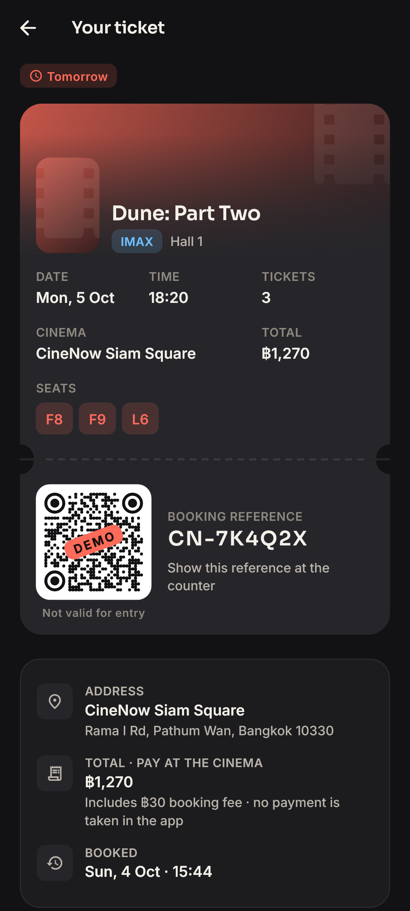&nbsp;
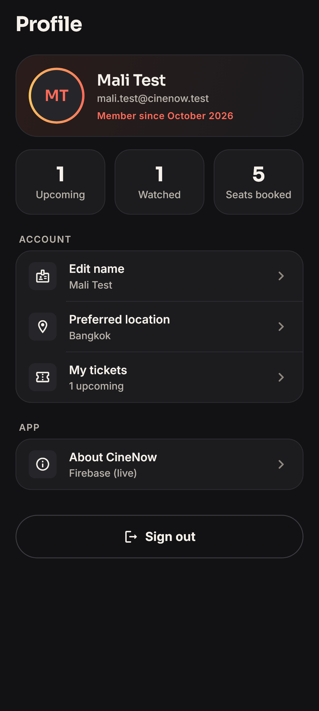&nbsp;
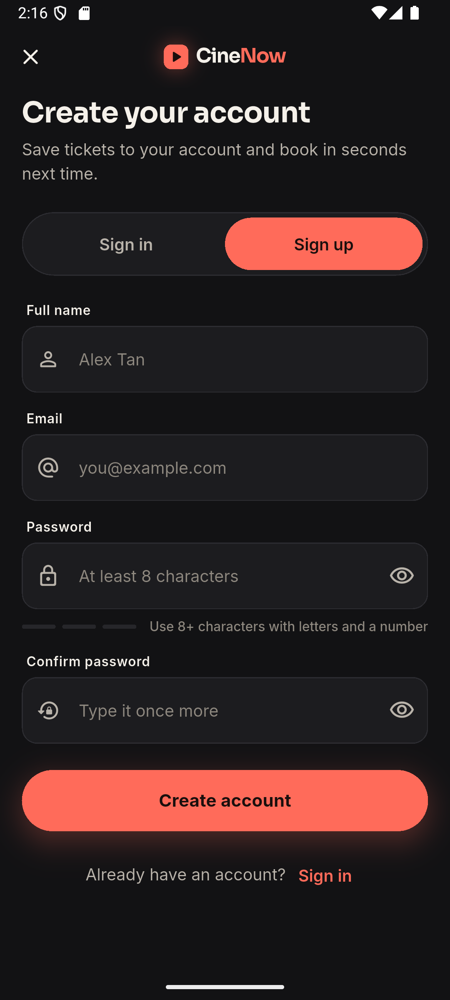
<br><br>
<sub>Screens in <code>test_screens/goldens</code> are test renders, so posters show their placeholder artwork.</sub>
</details>

---

## 🗂️ Project structure

```
lib/
  core/        theme (colours, fonts, spacing), router, config, helpers
  models/      Movie, Cinema, Showtime, SeatLayout, Reservation, …
  services/    Firebase + Demo implementations behind one interface
  state/       Riverpod providers (booking draft, auth, catalog, connection)
  widgets/     reusable UI: buttons, posters, seat map, ticket card, empty states
  screens/     welcome, auth, home, explore, details, booking flow, tickets, profile
assets/seed/catalog.json     movies, cinemas, halls, prices (source of all sample data)
firebase/                    database rules + sample database JSON
tool/                        seed generator + security-rule tests
```

---

<details>
<summary><b>🔥 Use your own Firebase project (optional)</b></summary>

Only needed if you want your own backend instead of the included one.

1. **Create a project** in the [Firebase console](https://console.firebase.google.com/).
2. Go to **Authentication → Get started → Email/Password → Enable**.
3. Go to **Realtime Database → Create database**, choose a location (Singapore is closest to Thailand), and select **locked mode**.
4. **Connect the app.** Run this from the project folder:
   ```bash
   npm install -g firebase-tools
   dart pub global activate flutterfire_cli
   firebase login
   dart pub global run flutterfire_cli:flutterfire configure --project=<your-project-id> --platforms=android --android-package-name=com.cinenow.app
   ```
   This replaces `lib/firebase_options.dart` and `android/app/google-services.json`.
5. **Upload the rules and sample data.** Put your project ID in `.firebaserc`, then run:
   ```bash
   firebase deploy --only database,auth
   firebase database:set / firebase/database.seed.json
   ```
   *No CLI?* In the console, open **Realtime Database → ⋮ → Import JSON** and pick `firebase/database.seed.json`. Then paste `firebase/database.rules.json` into the **Rules** tab and click **Publish**.

</details>

<details>
<summary><b>📅 Refresh showtimes</b></summary>

The sample data contains **21 days** of showtimes starting from its generation date (4 Oct 2026). To roll them forward without touching users or bookings, run:

```bash
dart run tool/generate_seed.dart --refresh
firebase database:update / firebase/database.refresh.json
```

Add `--days 30` or `--from 2026-11-01` to choose the range. Edit movies, cinemas, halls and prices in `assets/seed/catalog.json`.

</details>

<details>
<summary><b>🧪 Testing</b></summary>

```bash
flutter analyze
flutter test                                   # unit, widget and demo-mode tests
flutter test test_screens --update-goldens     # re-render the screenshots in test_screens/goldens
```

**Security-rule tests.** These 13 cases cover double booking, partial writes, fake owners and privacy. They need Java 11+ (Android Studio's bundled JBR works):

```bash
firebase emulators:start --only auth,database
cd tool/rules_test && npm install && npm test
```

**App + local emulators:**
- Run `flutter run --dart-define=USE_EMULATORS=true`. The Android emulator reaches your PC at `10.0.2.2`.
- Load the sample data with:
  ```bash
  curl -X PUT -H "Authorization: Bearer owner" --data-binary @firebase/database.seed.json "http://127.0.0.1:9000/.json?ns=cinenow-kmutnb-2026-default-rtdb"
  ```
- Test accounts for the **local emulator only** are in `firebase/emulator-test-accounts.json`.

</details>

<details>
<summary><b>🛠️ How it works (for developers)</b></summary>

**Database layout (Realtime Database)**

```
movies/{movieId}            title, genres, rating, runtime, synopsis, poster, cast…
cinemas/{cinemaId}          name, city, address, formats, halls
layouts/{layoutId}          seat rows (standard / deluxe) and aisles
showtimes/{movieId}/{id}    cinema, hall, format, date, time, prices
occupiedSeats/{id}/{seat}   who booked it + server timestamp
reservations/{uid}/{id}     the user's tickets (private)
users/{uid}                 the user's profile (private)
```

**Booking integrity:** tapping seats never writes anything. **Confirm** sends one multi-path update containing every seat *and* the reservation. Security rules reject any seat that already exists, so the whole booking either succeeds or fails. Seats can't be released or reassigned afterwards.

**Security rules:**
- Anyone can read the catalog and seat availability.
- Nobody can edit the catalog from the app.
- Users can read and write only their own profile and reservations.

</details>

<details>
<summary><b>❓ Troubleshooting</b></summary>

| Problem | Fix |
| --- | --- |
| Movies don't load / "You're offline" | Check the internet connection. Posters retry on their own once you're back online. |
| `INSTALL_FAILED_INSUFFICIENT_STORAGE` on an emulator | Use `flutter run --profile` (a much smaller build) or free space on the emulator. |
| Want to explore without an account | Tap **Browse movies first**. You only need to sign in to confirm a booking. |
| Want to run without Firebase at all | `flutter run --dart-define=FORCE_DEMO=true` |

</details>

---

## 🙏 Credits

- Film data and images come from [TMDB](https://www.themoviedb.org/). This product uses the TMDB API but is not endorsed or certified by TMDB.
- Synopses were written for this project. The cinemas are fictional.
- Fonts: [Sora](https://fonts.google.com/specimen/Sora) and [Inter](https://fonts.google.com/specimen/Inter), under the SIL Open Font License.
- Built with Flutter, Riverpod, go_router and Firebase.
